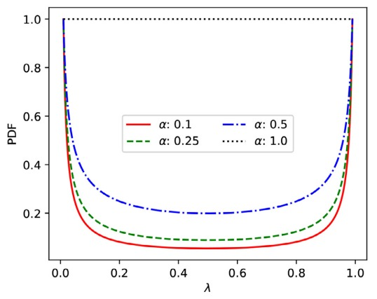

# 
Time Series Review

### Paper

<bold>Mixing up contrastive learning: Self-supervised representation learning for time series</bold>

Pattern Recognition Letters

#### 1.Introduction

1. Propose an **unsupervised contrastive learning framework** that is motivated from the perspective of label smoothing and is based on predicting the amount of mixing between data points.

2. The proposed approach uses a novel contrastive loss that naturally exploits a data augmentation scheme in which new samples are generated by mixing two data samples with a mixing component

#### 2.Model

+ **Simple Contrastive Learning**

  From "A Simple Framework for Contrastive Learning of Visual Representations, ICML 2020"

  

  data augmentation(数据增广) t~$\tau$

  encoder(数据编码) $f(·)$。

  projection header(投影首部) $g(·)$。

  contrastive loss(对比损失函数)

+ **New Contrastive Learning**

  

  Two minibatches are sampled randomly from the data and combined using Eq. (1). All samples are passed though an encoder f(·) resulting in a representation that can be used for down-stream tasks. Next, this representation is transformed using a projection head g(·) into a representation where the proposed contrastive loss is applied.

#### 3.Architecture

+ **Input** : 

  $x=\{x(t)\in\mathbb{R}|t=1,2,\dots,T\}$,

  where $t$ denotes each time step and $T$ denotes the length of the UTS(univariate time series).

+ **Output** : 
  + **Data augmentation** : At each training iteration, a new $λ$ is drawn randomly from a **beta distribution**, and two minibatches of size $N$, $\{x_1^{(1)},\dots,x_N^{(1)}\}$ and $\{x_1^{(2)},\dots,x_N^{(2)}\}$,are drawn randomly from the training data. Applying $\~x=λx_i+(1-λ)x_j$,the two minibatches are used to create a new minibatch of augmented samples, $\{\~x_1, \dots, \~x_N\}$.

    $α$ parameter set to 0.2 as suggested by Zhang et al.

    

  
  + **Encoder** : All three minibatches are passed through the encoder, $f(·)$, that transforms the data into a new representation, $\{h_1^{(1)},\dots,h_N^{(1)}\}, \{h_1^{(2)},\dots,h_N^{(2)}\}, \{\~h_1, \dots, \~h_N\}$. which can be used for down-stream tasks.

    We use the **fully convolutional network (FCN)** proposed by Wang et al. as an encoder $f$ for all contrastive learning approaches reported in this work. The FCN consists of three convolutional layers, each followed by batch normalization and a rectified linear unit activation function, and an adaptive average pooling layer. The convolutional layers consist of 128, 256, and 128 filters from first to third layer. This choice is motivated by the FCN’s strong performance on a number of time series benchmark tasks Wang et al. and its simplicity. Specifically, the encoder representation will be the output of the average pooling layer.

  + **Projection header** : Next, the new representations are again transformed into a task-dependent representation, $\{z_1^{(1)},\dots,z_N^{(1)}\}, \{z_1^{(2)},\dots,z_N^{(2)}\}, \{\~z_1, \dots, \~z_N\}$, by the projection head, $g(·)$, where the contrastive loss is applied.

    For the projection head $g$, we use a **two-layer neural network with 128 neurons in each layer** and separated by a rectified linear unit non-linearity, inspired by Chen et al.. All models are optimized using the ADAM optimizer for 1000 epochs,

#### 4.Loss

+ **Original Loss** : 

  

  where $τ$ denotes a temperature parameter.

+ **New loss** : 

  

  where $DC (·)$ denotes the cosine similarity and $τ$ denotes a temperature parameter.

  $τ$ is set to 0.5 as suggested by Chen et al.

#### 5.Experiments

+ **Classification**

  We use a 1-nearestneighbor (1NN) classifier to evaluate quality of different representations.

+ **Data**

  + **UCR**

    The UCR contains 128 UTS datasets. (update in 2018)

    

    https://www.cs.ucr.edu/~eamonn/time_series_data_2018/

    is labeled——yes

    ED represents **the Euclidean distance(欧氏距离)**, DTW is **the dynamic time warping algorithm(动态时间规整算法)**, and DTW (learned_w) represents **the window constrained DTW algorithm (an improved DTW algorithm)(窗口约束DTW算法)**. These algorithms are all spatial distance measurement algorithms. The following error rate is the **classification error rate of 1-NN classification algorithm** combined with ED, DTW and its improved distance measurement algorithm.

  + **UEA**

    The UEA archive contains 30 MTS datasets. (update in 2018)

    

    https://arxiv.org/abs/1811.00075

    is labeled——yes

+ **Baseline**
  + **Handcrafted features (HC)**: Extract the maximum, minimum, variance and mean value of each time series. This is an elementary and well-known approach that will act as a simple baseline.
  
  + **Raw input features (ED)**: Using the raw time series as input without any alterations. This will demonstrate if it is beneficial to transform the time series.

  + **Autoencoder features (AE)**: A deep learning-based baseline using an autoencoder framework. We use the same network as with the proposed method, and a mirrored encoder for the decoder. The model is trained using a mean squared error reconstruction loss for 250 epochs. Autoencoder-based learning of features from time series with a reconstruction loss is a typical approach in the literature.

  + **Contrastive learning features (CL)**: A deep learning-based baseline based on the widely used SimCLR framework. We use the same network as with the proposed method, but with different data augmentation and the standard contrastive loss of instead of the mixup contrastive loss. We consider two data augmentation techniques, gaussian noise with a variance of 0.25 (CL (σ = 0.25)) and dropout noise with a dropout rate of 0.25 (CL (ρ = 0.25)). These noise parameters represent an average amount of noise suitable for most datasets.

+ **Result**

  

  

#### 6.Transfer learning for clinical time series

+ 

    We perform transfer learning for **classification of echocardiograms** (ECGs) datasets with limited amount of training data.

+ **Procedure**

  + First, we train an encoder using the proposed contrastive learning framework on a pretext task where a larger amount of data is available.

    Pretext task datasets(all obtained from the UCR archive) : 

        Syntehetic Control (Synthetic)

        Swedish Leaf (Dissimilar)

        ECG5000(Similar)

  + Next, we use theweights of the encoder to initialize the weights of a supervised model(FCN).

    Baseline : Weights are randomly initialized using He normal initialization.

+ **Result**

  

  

